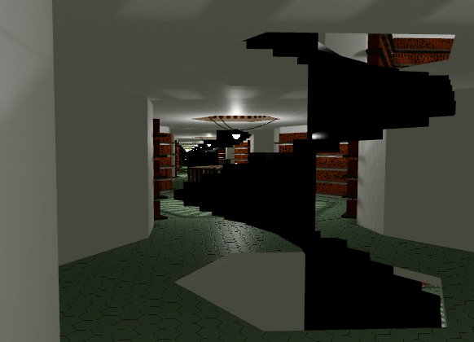
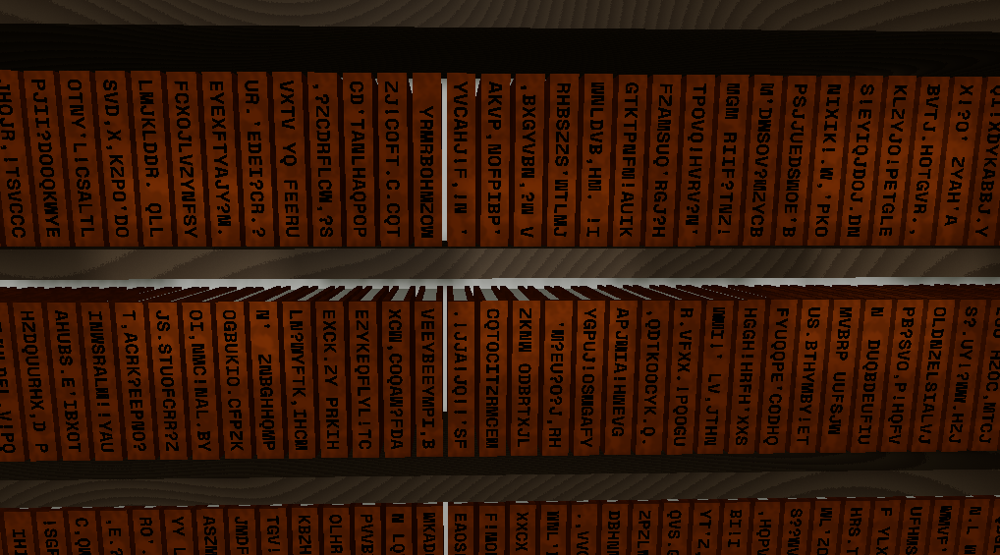
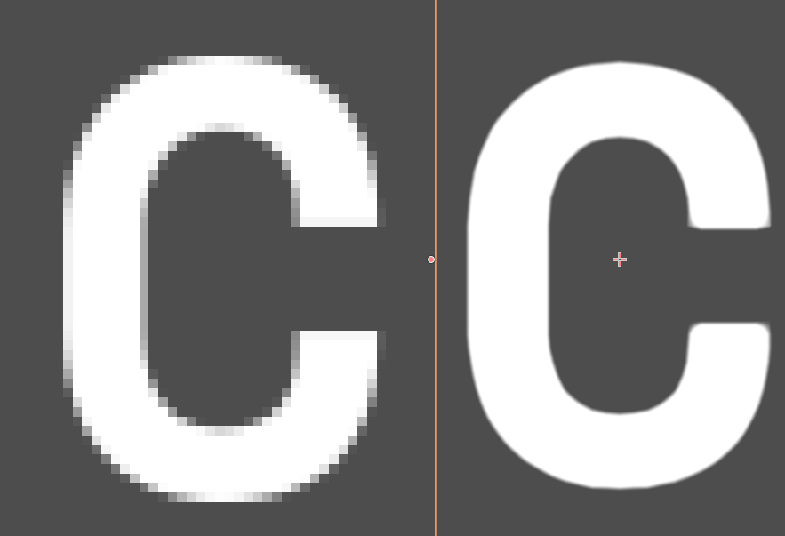

# Total Library

Check it out on itch.io: https://mathematastic.itch.io/total-library

A replica of the library from Jorge Luis Borges' story *The Library of Babel*. Every single book in one massive library, all crammed into a 20MB download. No render distance limit, gaze off into infinity. Everything is generated in real-time.

Minimum specs:
* Resolution = 720p
* Computer = yes

(If things are slow, turn off shadows)

Made in [Godot](https://godotengine.org) v3.5.1

License is MIT, copyright Henry Conklin 2022, except:
* the [in-game font](assets/fonts/) which is [Space Mono](https://fonts.google.com/specimen/Space+Mono) under the [Open Font License](https://scripts.sil.org/cms/scripts/page.php?site_id=nrsi&id=OFL)
* the [room tone audio](assets/audio/) which uses [this license](https://gamesounds.xyz/Sonniss.com%20-%20GDC%202020%20-%20Game%20Audio%20Bundle/License.pdf) and came from [gamesounds.xyz](https://gamesounds.xyz/?dir=Sonniss.com%20-%20GDC%202020%20-%20Game%20Audio%20Bundle/Articulated%20Sounds%20-%20Empty%20Hotel%20Quiet%20Room%20Tones)
* the [wood grain shader](assets/materials/shaders/wood_shader.gdshader) which is slightly modified from one by Yi Kinomoto (@arlez80) at https://godotshaders.com/shader/procedural-grain-wood-shader/ which is also under MIT, but not by me
* everything under `addons/gut` which is [Gut](https://github.com/bitwes/Gut), also MIT license but not by me

Some related projects:
* https://libraryofbabel.info/
* [Library of Babel](https://keiwan.itch.io/library-of-babel-3d) by Keiwan, another game with [source code available](https://github.com/keiwando/libraryofbabel3D)

## Interesting Things

### Infinite Hallway Effect

This works using what is essentially half a portal and a tilable hallway segment.

Check out the code:

* [PortalPlane.tscn](assets/props/PortalPlane.tscn)
* [PortalPlane.gd](assets/props/PortalPlane.gd)

Take a camera rendering to a [viewport](https://docs.godotengine.org/en/3.5/tutorials/rendering/viewports.html), place it one segment back from the end of the hallway, then render its view to a flat plane covering the end of the hallway. Since the plane is included in the view of the camera, each frame the camera will add another copy of the hallway segment to the image drawn on the plane. At a high enough framerate, and from far enough away, the image on the plane looks like an infinite hallway with the correct perspective.

At lower framerates the hallway can appear to bend as the player moves, because the further iterations of the rendering aren't refreshed fast enough to account for the movement.

If the plane is too close to the main camera, the difference in perspective between the first and second iteration is too big and the hallway appears stretched.

The game uses three "real" copies of the hallway segment, then uses this effect to render the rest. It should have the same performance as rendering one extra iteration of the hallway.

The viewport camera also needs to be set up to follow the main camera and use the right view frustum. The viewport camera should:
* have it's position match the main camera's position but displaced back by the length of a hallway segment.
* be pointed parallel to the normal of the plane that's displaying the viewport texture. Importantly not pointed *at* the plane or the view will be weird and skewed.
* use the right custom frustum projection. In Godot this is the "Frustum" projection mode, with the "Frustum Offset" set to the main camera's position projected onto the display plane, the far plane set just past the display plane, and the near plane set one segment's length behind the display plane.

And to get the viewport texture to look right:
* make sure the plane's material has "unshaded" enabled so that it doesn't catch shadows or light
* flip the texture vertically by checking "V Flip" in the viewport because of the coordinate system mismatch between "textures" and "images". "Textures" tend to put the origin in the bottom left, "images" put it in the top left with `y` pointing down.
* enable "Albedo Tex Force sRGB" in the material settings to stop the texture from fading to white with each iteration. Not entirely sure why this is necessary, but there is apparently some mismatch in between the color space of the texture and the color space Godot using to interpret it.
* set the shadow atlas size on the viewport to something non-zero. It defaults to 0 which disables shadows in the viewport texture and makes things brighter than they should be.

### Random Permutation of Borges' Number

[See the code](native/src)

Having the books in alphabetical order would be boring. Part of the mystery of the story involves people occasionally finding books with recognizable patterns. In my mind this means the books are shuffled in some seemingly random order.

It would make sense to have some kind of reasoning behind the order, but trying to pick some kind of constraint to optimize the order for doesn't help much. For example, trying to minimize the distance to an instance of any given query string from any given position in the library is satisfied well by alphabetical order. Just look at the least significant characters which cycle through all possible query strings of every length as evenly as possible. It may be able to do better using the entire book for subqueries, but that would likely require favoring certain lengths of queries and  would be a nightmare to find an optimal ordering. So, I'm going to settle with a random-looking ordering.

In the story Borges states there are 25 symbols: the period, comma, space, and *22* letters of the alphabet. From [this source](https://www.gwern.net/docs/borges/1939-borges-thetotallibrary.pdf) Borges explains that his count of 22 letters comes from throwing out several letters he considers redundant. I plan to use all 26 letters of the English alphabet along with the period, comma, apostrophe, space, exclamation mark, and question mark for 32 total characters. I intentionally targeted a power-of-two number of characters because that ends up being much more efficient.

Borges also states there are 410 pages to each book, each page with 40 lines, and each line with 80 characters. I ended up reducing this to 100 pages for the sake of runtime and 18 lines of 25 characters for legibility.

That gives a total of $100 \cdot 18 \cdot 25 = 45,000$ characters per book, a total of $32^{45,000}$ unique books, and about 28KB of data to represent one book.

With that set, let's lay out some requirements:
1. Every book needs to appear exactly once in the sequence. That is, it needs to be a permutation and therefore a bijection from the set of books onto itself.
2. We need fast random access to any point in the sequence.
3. Neighboring books and rooms can't look similar, in particular the titles. I won't require them to pass any kind of randomness test, all I need is to avoid any obvious patterns.

[This stackoverflow post](https://stackoverflow.com/questions/32357710/efficient-way-to-generate-a-seemingly-random-permutation-from-a-very-large-set-w) suggests a way to generate a random permutation of a large $N$ using modular exponentiation. However, that requires $N$ to be a prime number, which is ipmossible because our N is always a power of something, or it requires you to pick a prime larger than $N$ and skip any numbers you generate larger than $N$. That means the numbers can only be generated in sequence as there is no efficient way to know how many numbers have been skipped at any point in the sequence. Also, The number picked may produce a much smaller cycle than the full set of books, in particular the order of the subgroups is always a divisor of $p-1$ and finding a subgroup with order $p-1$ is non trivial. You essentially have to check the full cycle, or check at divisors of $p-1$ that it hasn't looped back to $1$.

The author of the site [libraryofbabel.info](https://libraryofbabel.info) shares one of their methods which involves a modular multiplication and some bit shuffling inspired by Mersenne Twister: https://github.com/librarianofbabel/libraryofbabel.info-algo

This method works fairly well and is essentially what I went with. The multiplier can be picked at random, and that alone does a pretty good job hiding patterns between consecutive books. However, when moving between rooms it can leave the lower third of the books identical because of the larger shift. To account for that we can do a `x ^= x >> n` to mix up the lower bits using the higher bits. The only thing we need to do to guarantee that this is a permutation is show how to invert each of these steps, i.e. that every book is produced exactly once in the shuffling. This is true when the multiplier is coprime with the number of books, and the bit shift `n` is greater than half the number of bits in the number of books. The first point comes from abstract algebra, treating the books as a cyclic group. The second is relatively easy to show, let:

$$
y = x \wedge (x >> n)
$$

Then as long as $n$ is greater than half the length of the number:

$$
y >> n = x >> n
$$

And since xor is its own inverse:

$$
y \wedge (x >> n) = x \wedge (x >> n) \wedge (x >> n) = x
$$

$$
y \wedge (y >> n) = x
$$

So this is invertible by applying the same operation to the output. It's also quick for random access and looks good in practice so meets all the requirements and I'm happy with it.

### Rendering the books

Here's the shader: [book_shader.gdshader](assets/materials/shaders/book_shader.gdshader)

There are a lot of books in view at any given time so optimizing their render cost is important. They're also the focus of the game so they need to look nice.

There are two modes I've settled on for rendering the books:
1. A book on a shelf or on the ground. Always closed, only need to render the title, cover, and sides of the pages.
2. A book in-hand, potentially open. Needs to be rigged and animated, needs to render large amounts of text inside. Only one at a time.

#### Shelf/Floor books
There could be thousands of books in view at any given time. I also want to display the book's title on its spine, meaning there needs to be some kind of text rendering for all of them.

I've chosen to render the shelf books as [multimeshes](https://docs.godotengine.org/en/stable/tutorials/optimization/using_multimesh.html) which I believe uses GPU instancing. I provide the book mesh and the transforms for each book it should render. I can also pass a color and "custom data" (also formatted as a color) to each instance. Each color gives me four floats to pack some data into. Unfortunately though, I couldn't use all of the bits for each float. Somewhere in the pipeline the floats must get reinterpreted and my title data wasn't getting through. I was able to use the 23 bits in the mantissa to store an int value which I could cast back and forth losslessly. That gives me 92 bits in just the color data which is more than enough.

The title is then rendered using a font atlas texture and a bunch of UV transform fuckery. These titles can be viewed at a very wide range of sizes and angles. Using normal texture would make the text look pixelated close-up unless it was rendered at a very high resolution. Instead I'm using a technique from [this paper from Valve](https://steamcdn-a.akamaihd.net/apps/valve/2007/SIGGRAPH2007_AlphaTestedMagnification.pdf) which describes how to use Signed Distance Fields (SDFs) to render vector graphics using raster textures. In summary the process is:
1. Render your desired vector image at a high resolution
2. Resample at a lower resolution, storing the distance to the closest pixel of the opposite transparency in the high-resolution image
3. When rendering, make sure the texture is using bilinear sampling and put a threshold on the alpha channel

I got good results with a 1024 "size" source font (not sure if pt size or pixel height) and a 64 pixel height SDF texture output.

Check out my conversion script:
* [SDFConverter.tscn](scripts/util/SDFConverter.tscn)
* [SDFConverter.gd](scripts/util/SDFConverter.gd)
* [SDFConverter.gdshader](scripts/util/SDFConverter.gdshader)

The technique only requires one line of code in the shader, but does require a somewhat slow preprocessing step. Here's a comparison of a regular font and an SDF-ified version with the same resolution:

The SDF font can draw straight lines with a large range of slopes, with the slope changing at most once per pixel in the raster texture. It also tends to round off sharp corners. Overall though it is higher quality than even a much higher resolution raster version.

Fortunately, [Godot 4 has an improved version of this called MSDF built-in](https://github.com/godotengine/godot/pull/60513). So some time in the next decade when it comes out we can all use this effortlessly.

#### Held book
The held book is rigged and animated in Blender, then exported to Godot. Whenever the player picks up one of the other books, we can swap it out for the held book model and animate it.

There can be 4 full pages in view as a page is turned, there isn't any easy way to pass all that as text to the shader like we did for the titles. Instead, the best route for this is to prerender the visible pages to viewport textures and apply them to the book pages. The impact for this should be minimal as long as we guarantee that there is only one open book at a time, which only requires closing the book as it's put down.
